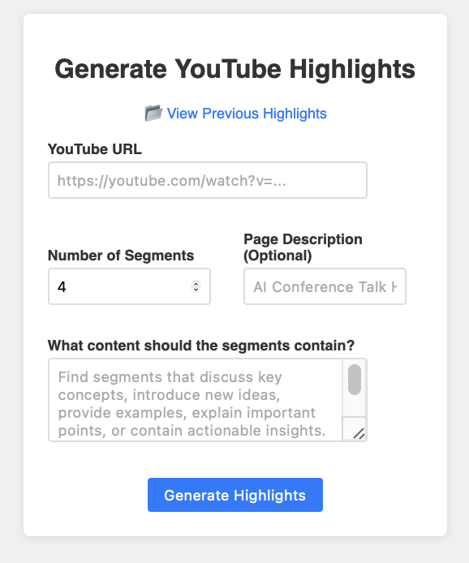

# YouTube Highlight Generator

A powerful tool that automatically creates beautiful highlight pages from YouTube videos and their transcripts. Perfect for educational content, presentations, and creating shareable video summaries that can be deployed to Netlify.



## 🎯 What It Does

1. **Parses Transcripts** - Supports WebVTT (.vtt) and SRT (.srt) formats
2. **Finds Key Segments** - Uses keyword-based detection to identify interesting parts
3. **AI Summarization** - Creates concise summaries using BART model with fallback
4. **Extracts Thumbnails** - Generates representative frames for each segment
5. **Builds Static Site** - Creates a beautiful HTML page ready for Netlify deployment

## 🚀 Quick Start

### Installation

```bash
# Clone or download the project
cd youtube-highlight-generator

# Install dependencies
pip install -r requirements.txt
```

### Basic Usage

```bash
python generate_video_cards.py \
    "https://www.youtube.com/watch?v=dQw4w9WgXcQ" \
    transcript.vtt \
    --description "Amazing Demo Video" \
    --keywords introduction conclusion demo \
    --cards 4 \
    --output-dir my_highlights
```

### Parameters

- `youtube_url` - The YouTube video URL
- `transcript_file` - Path to your .vtt or .srt transcript file
- `--description` - Optional description for the page title
- `--keywords` - Space-separated keywords to find interesting segments
- `--cards` - Number of highlight cards to generate (default: 4)
- `--output-dir` - Output directory name (default: 'output')

## 📁 Output Structure

The tool generates a complete static site:

```
my_highlights/
├── index.html              # Main highlight page
├── video.mp4              # Downloaded video file
├── thumbnail_001.png      # Segment thumbnails
├── thumbnail_002.png
├── thumbnail_003.png
└── thumbnail_004.png
```

## 🎨 Features

### Intelligent Segmentation
- **Keyword Detection**: Finds segments containing specified keywords
- **Context Inclusion**: Each keyword match includes 5 surrounding transcript entries
- **Smart Fallback**: Automatically fills remaining cards by splitting unused content
- **Flexible Card Count**: Generate 1-20+ highlight cards as needed

### AI-Powered Summarization
- **BART Model**: Uses Facebook's BART-large-CNN for high-quality summaries
- **Graceful Fallback**: Falls back to extractive summarization if AI unavailable
- **Length Control**: Generates concise, readable summaries (10-60 words)
- **Context Aware**: Summarizes the full segment context, not just keywords

### Professional Design
- **Responsive Layout**: Works perfectly on desktop, tablet, and mobile
- **Modern UI**: Glass morphism design with gradient backgrounds
- **Interactive Cards**: Hover effects and smooth animations
- **Embedded Player**: YouTube video embedded at the top
- **Direct Links**: Each card links to the exact timestamp on YouTube

### Robust Processing
- **Format Support**: WebVTT and SRT transcript formats
- **Error Handling**: Comprehensive error handling with helpful messages
- **Video Quality**: Automatically selects best available video quality
- **Frame Accuracy**: Extracts frames at precise segment midpoints
- **Cross-Platform**: Works on Windows, macOS, and Linux

## 📋 Getting Transcripts

### Method 1: YouTube Auto-Generated
1. Go to your YouTube video
2. Click the "..." menu → "Open transcript"
3. Copy the text or use browser extensions to download

### Method 2: Professional Tools
- **Rev.com** - Professional transcription service
- **Otter.ai** - AI-powered transcription
- **YouTube Creator Studio** - For your own videos

### Method 3: Auto-Generated with Tools
- **youtube-dl** - Can extract auto-generated captions
- **yt-dlp** - Modern fork with better caption support

## 🌐 Deployment to Netlify

### Method 1: Drag & Drop
1. Run the generator to create your output folder
2. Go to [netlify.com](https://netlify.com)
3. Drag your output folder onto the Netlify dashboard
4. Your site is live! 🎉

### Method 2: Git Integration
1. Push your output folder to a Git repository
2. Connect the repository to Netlify
3. Auto-deploy on every update

### Method 3: Netlify CLI
```bash
npm install -g netlify-cli
netlify deploy --dir=my_highlights
netlify deploy --prod --dir=my_highlights
```

## 🛠️ Advanced Usage

### Custom Keywords Strategy
```bash
# Educational content
--keywords "introduction" "methodology" "results" "conclusion"

# Tutorial videos  
--keywords "setup" "configuration" "implementation" "testing"

# Presentation
--keywords "agenda" "problem" "solution" "demo" "questions"
```

### Multiple Output Formats
```bash
# Create different versions for different audiences
python generate_video_cards.py "URL" transcript.vtt --keywords "beginner" "basics" --cards 3 --output-dir beginners

python generate_video_cards.py "URL" transcript.vtt --keywords "advanced" "expert" --cards 6 --output-dir advanced
```

### Batch Processing
```bash
#!/bin/bash
# Process multiple videos
for video in videos/*.txt; do
    url=$(head -n1 "$video")
    transcript="${video%.txt}.vtt"
    output="output_$(basename "$video" .txt)"
    
    python generate_video_cards.py "$url" "$transcript" --output-dir "$output"
done
```

## 🔧 Customization

### HTML/CSS Modifications
The generated HTML includes embedded CSS that you can modify:
- Colors and gradients
- Card layouts and spacing  
- Typography and fonts
- Responsive breakpoints

### Segmentation Algorithms
Extend the `SegmentFinder` class to implement:
- **Topic Modeling**: Use LDA or other algorithms
- **Semantic Similarity**: Sentence embeddings with clustering
- **Scene Detection**: Visual changes in video content
- **Audio Analysis**: Silence detection, speaker changes

### Summarization Models
Replace the BART model with:
- **Domain-specific models**: Fine-tuned for your content type
- **Multilingual models**: For non-English content
- **Faster models**: DistilBART for speed over quality
- **Custom models**: Train your own on similar content

## 🐛 Troubleshooting

### Common Issues

**"Missing required dependency" error**
```bash
pip install -r requirements.txt
# If that fails, install individually:
pip install pytube moviepy transformers torch pillow numpy
```

**"No suitable video stream found"**
- Video may be private, age-restricted, or region-locked
- Try a different YouTube URL
- Check if the video is still available

**"AI summarization failed"**
- This is normal - the tool falls back to extractive summarization
- For better AI summaries, ensure you have enough RAM (8GB+)
- Consider using a smaller model like DistilBART

**"Frame extraction failed"**
- Video file may be corrupted during download
- Try deleting the output directory and running again
- Some videos have unusual formats that MoviePy can't handle

### Performance Tips

**Speed up processing:**
- Use fewer cards (`--cards 3` instead of 6+)
- Shorter videos process faster
- SSD storage improves I/O performance

**Reduce memory usage:**
- Close other applications during processing
- Use extractive summarization only (comment out transformers import)
- Process videos shorter than 30 minutes

## 📊 Example Output

Here's what the generated page looks like:

```
Video Highlights - Amazing Demo Video
=====================================

[Embedded YouTube Player]

┌─────────────────┐ ┌─────────────────┐ ┌─────────────────┐
│  [Thumbnail]    │ │  [Thumbnail]    │ │  [Thumbnail]    │
│                 │ │                 │ │                 │
│ Introduction to │ │ The methodology │ │ Key findings    │
│ the topic and   │ │ used involves   │ │ show significant│
│ objectives...   │ │ three phases... │ │ improvement...  │
│                 │ │                 │ │                 │
│ Starts at 00:15 │ │ Starts at 03:42 │ │ Starts at 08:15 │
│ [Watch Segment] │ │ [Watch Segment] │ │ [Watch Segment] │
└─────────────────┘ └─────────────────┘ └─────────────────┘
```

## 🤝 Contributing

Contributions welcome! Areas for improvement:
- Support for more video platforms
- Better segmentation algorithms
- Additional output formats (PDF, presentations)
- Integration with other AI models
- Batch processing UI

## 📝 License

MIT License - feel free to use for personal and commercial projects.

## 🙏 Acknowledgments

- **PyTube** - YouTube video downloading
- **MoviePy** - Video processing and frame extraction  
- **Transformers** - Hugging Face AI models
- **BART** - Facebook's summarization model
- Inspired by the educational content creation community

---

**Ready to create amazing video highlights? Get started now!** 🚀
